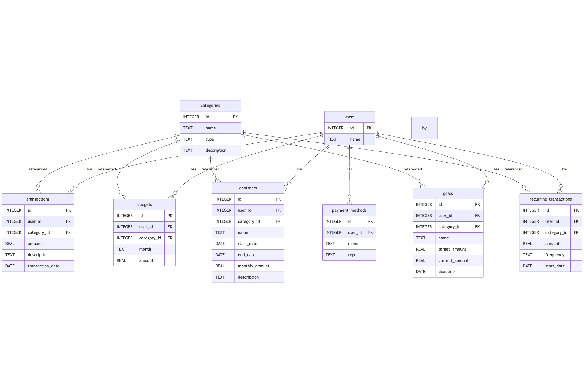

# Budget Tracker Database

  # 💰 Budget Tracker Database

  **Author:** Serhan Miah  
  **Course:** Harvard CS50 SQL Track  
  **Video Overview:** *[Insert Video URL Here]* 

   ## 📌 Project Overview

  The Budget Tracker Database is a personal finance management system that enables users to track their expenses, income, budgets, savings goals, and recurring financial obligations. Inspired by common personal finance needs and budgeting applications, the project is implemented entirely in SQLite. It serves as a backend database capable of supporting a frontend client or command-line interface in the future.

  This project was built as the final submission for CS50’s Introduction to Databases with SQL. It demonstrates normalized schema design, relational integrity, foreign key constraints, joins, filtering, and aggregation.

  ## Motivation
    
  Personal financial health is a core part of many people’s lives, yet many struggle to stay on top of their budgeting, bills, and savings. While many applications exist for tracking finances, designing such a system from scratch offered an opportunity to deeply explore relational database principles, such as:

  - Managing multiple types of financial records (transactions, recurring payments, budgets).

  - Modeling user behavior and constraints.

  - Building queries that provide real insights (budget vs. actual spend, goal progress).

  - Ensuring data integrity with foreign keys and proper normalization.

  - The goal was to build something useful, scalable, and extensible, while applying what I learned about SQL schema design and query writing.

 ## 📦 Scope

  **Purpose:**  
  The purpose of this database is to empower users to make informed financial decisions by providing tools to monitor spending, plan budgets, and manage recurring financial commitments.

  **Included in Scope:**  
  - Individual users tracking personal finances  
  - Transactions (income and expenses)  
  - Budgets categorized by month  
  - Recurring payments like subscriptions  
  - Savings goals  
  - Payment methods (e.g., bank, card, cash)

  **Outside the Scope:**  
  - Real-time banking API integration  
  - Multi-user or enterprise support  
  - Investment or trading features  
  - User authentication/login system  
  - Multi-currency support

  ---

## ✅ Functional Requirements

  **What Users Can Do:**
  - Add and categorize transactions  
  - Set and track monthly budgets  
  - Monitor spending vs. budget  
  - Manage recurring payments (e.g., subscriptions)  
  - Define and track savings goals  
  - Record payment methods used

  **What Users Cannot Do:**
  - Sync directly with banks or credit cards  
  - Use multiple currencies  
  - Authenticate into personal accounts  
  - Analyze investments or predict future spending

  ---
  ## 🧱 Representation

  ### Entities

  The database includes the following entities:

  - `Users`: Stores information about individuals using the tracker  
  - `Transactions`: Records of income or expense entries  
  - `Categories`: Classification of transactions (e.g., Rent, Salary)  
  - `Budgets`: Monthly allocated amounts per category  
  - `Contracts`: Ongoing commitments like rent or subscriptions  
  - `Recurring_Transactions`: Automatically repeating transactions  
  - `Goals`: User-defined savings targets  
  - `Payment_Methods`: Source of payments (e.g., Credit Card, Bank Transfer)

  ## 🧩 Database Schema

  ### Tables and Key Fields

  | Table                | Key Fields                                                                 |
  |----------------------|----------------------------------------------------------------------------|
  | Users              | id, name                                                               |
  | Transactions       | id, user_id, category_id, amount, description, transaction_date |
  | Categories         | id, name, type (income or expense), description               |
  | Budgets            | id, user_id, category_id, month, amount                         |
  | Contracts          | id, user_id, category_id, name, start_date, end_date, monthly_amount, description |
  | RecurringTransactions | id, user_id, category_id, amount, frequency, start_date    |
  | Goals              | id, user_id, category_id, name, target_amount, current_amount, deadline |
  | PaymentMethods     | id, user_id, name, type                                           |

  - **Primary keys** are integers.
  - **Foreign keys** maintain data integrity between tables (e.g., user_id, category_id).

  **Types and Constraints:**  
  - `INTEGER PRIMARY KEY` for unique identifiers  
  - `TEXT` for names and descriptions  
  - `REAL` for financial values  
  - `DATE` or `TEXT` (formatted as YYYY-MM-DD) for dates  
  - `CHECK` constraints to ensure valid types (e.g., only "income" or "expense")

  ### Relationships

  - A `User` can have many `Transactions`, `Budgets`, `Contracts`, `Recurring_Transactions`, `Goals`, and `Payment_Methods`.  
  - Every `Transaction`, `Budget`, and `Contract` is linked to a `Category`.  
  - Foreign keys ensure relational integrity across the database.

In this section you should include your entity relationship diagram and describe the relationships between the entities in your database.

**Entity Relationship Diagram:**  

## Optimizations

In this section you should answer the following questions:

* Which optimizations (e.g., indexes, views) did you create? Why?

## Limitations

In this section you should answer the following questions:

* What are the limitations of your design?
* What might your database not be able to represent very well?
